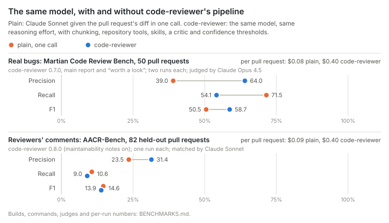
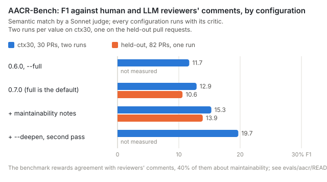

# Benchmarks

What Code Reviewer finds, measured against real bugs, against what human and LLM reviewers wrote on the same
pull requests, and by blind audits of its own findings. Every number on this page names the build that
produced it (a commit of this repository), the exact command and the judge that scored it: see
[How each number was produced](#how-each-number-was-produced).

## At a glance

<picture>
  <source media="(prefers-color-scheme: dark)" srcset="docs/img/martian-positioning-dark.svg">
  
</picture>

[Martian's Code Review Bench](https://github.com/withmartian/code-review-benchmark): 50 pull requests of
Sentry, Grafana, Cal.com, Discourse and Keycloak with 158 verified bugs and defects. Every row below was
scored by the same judge, Claude Opus 4.5 (the leaderboard's judge model); the published tools were re-judged
from the review comments they posted. Their own published scores are on
[Martian's leaderboard](https://codereview.withmartian.com) ([data at the measured commit](https://github.com/withmartian/code-review-benchmark/blob/e616e849755441da38f18bf3adba2c9583b03803/offline/analysis/benchmark_dashboard.json)), and the judge's
verdicts behind every row are in [evals/martian/judgings/2026-10-01](evals/martian/judgings/2026-10-01/README.md).

| Reviewer | Findings / PR | Precision | Recall | F1 | Cost / PR | Verdicts |
|---|---|---|---|---|---|---|
| Augment (#3 on the leaderboard), re-judged | 3.6 | 58.1% | 63.3% | **60.6%** | — | [json](evals/martian/judgings/2026-10-01/augment.json) |
| Qodo Extended (#1), re-judged | 3.0 | 61.4% | 59.5% | 60.5% | — | [json](evals/martian/judgings/2026-10-01/qodo-extended.json) |
| **code-reviewer `main` + `--sweep`** (opt-in, unreleased), main report + "worth a look" | 3.4 | 57.4% | 63.9% | 60.5% | $0.61 | [run 1](evals/martian/judgings/2026-10-01/code-reviewer-sweep-run1-all.json), [run 2](evals/martian/judgings/2026-10-01/code-reviewer-sweep-run2-all.json) |
| **code-reviewer 0.7.0**, main report + "worth a look" | 2.6 | 64.0% | 54.1% | 58.7% | $0.40 | [run 1](evals/martian/judgings/2026-10-01/code-reviewer-0.7.0-run1-all.json), [run 2](evals/martian/judgings/2026-10-01/code-reviewer-0.7.0-run2-all.json) |
| The same model given the diff in one call | 5.9 | 39.0% | **71.5%** | 50.5% | $0.08 | [run 1](evals/martian/judgings/2026-10-01/plain-model-run1.json), [run 2](evals/martian/judgings/2026-10-01/plain-model-run2.json) |
| **code-reviewer 0.7.0**, main report | 1.6 | **73.3%** | 37.3% | 49.5% | $0.40 | [run 1](evals/martian/judgings/2026-10-01/code-reviewer-0.7.0-run1-main.json), [run 2](evals/martian/judgings/2026-10-01/code-reviewer-0.7.0-run2-main.json) |
| Claude Code CLI (#12), re-judged | 3.5 | 41.8% | 41.8% | 41.8% | — | [json](evals/martian/judgings/2026-10-01/claude-code-cli.json) |

- **Within two F1 points of the leaderboard's best.** Code Reviewer's full report, main findings and
  "worth a look", scores 58.7 against 60.5 for Qodo Extended and 60.6 for Augment, the leaderboard's first
  and third tools. The paired difference to Qodo Extended, −1.8 points, is within the noise (95% interval
  −10.0..+5.9). Code Reviewer is the more precise of the three and finds fewer of the bugs.
- **Level with them with `--sweep`.** The opt-in sweep on `main`, one more call over the whole diff whose
  findings go to the same critic, raises the full report to 60.5 (recall 63.9%) for about half again the price.
- **The most precise main report.** 73% of the findings in the main report, the part Code Reviewer posts
  on a pull request, match a known bug. Even under the leaderboard's more lenient scoring, only Graphite is
  more precise (100%), and it finds 8% of the bugs ([published data](https://github.com/withmartian/code-review-benchmark/blob/e616e849755441da38f18bf3adba2c9583b03803/offline/analysis/benchmark_dashboard.json)).
- **More than the model alone, though not more bugs.** The same model given the diff in one call finds
  the most known bugs on this page, 72%, but only 39% of its six findings per pull request match one. The
  pipeline's full report scores 8 F1 points higher (95% interval +0.7..+15.4), at five times the price.

Rows for Code Reviewer and the plain model are averages of two runs. The published tools were re-judged from
the review comments they posted, as the benchmark checked them in; why, and their published scores, are
under [Judge calibration](#judge-calibration).

## Three kinds of ground truth

| Source | What a "hit" is | Size | What it tells |
|---|---|---|---|
| **Martian Code Review Bench** | a verified bug or defect in a real pull request, matched by text | 50 PRs of Sentry, Grafana, Cal.com, Discourse, Keycloak; 173 golden comments, 158 in the core profile | how many known bugs a review finds, and how much else it reports |
| **AACR-Bench** (ctx30 and a held-out half) | a comment a human or an LLM reviewer left on the PR, matched on the same lines by text | 30 + 82 PRs of 22 repositories, 286 + 670 references; 79% written by LLM reviewers, 40% about maintainability | how much the review resembles what reviewers write |
| **Blind audit** | an auditor reading the code labels each finding real, debatable or wrong, without seeing its scores | 100–160 findings per release | the real precision of each tier, and whether the scores are calibrated |
| **Built-in eval corpus** ([docs/evals.md](docs/evals.md)) | a defect planted in a small change, matched by line | 33 cases, 8 stacks, 8 clean changes | regressions in prompts, skills and models; saturated at 100% recall |

## The pipeline against the plain model

<picture>
  <source media="(prefers-color-scheme: dark)" srcset="docs/img/plain-vs-pipeline-dark.svg">
  
</picture>

What does Code Reviewer add over asking its model directly? The plain baseline
([evals/plain-llm.py](evals/plain-llm.py)) gives Claude Sonnet, Code Reviewer's model, at the same reasoning
effort, the pull request's diff in one call, and asks for its bugs, security problems and other real defects.
It gets no chunking, related files, repository tools, skills, critic or thresholds.

| Benchmark | Reviewer | Findings / PR | Precision | Recall | F1 | Cost / PR |
|---|---|---|---|---|---|---|
| Martian, 50 PRs | the plain model, one call | 5.9 | 39.0% | **71.5%** | 50.5% | $0.08 |
| | code-reviewer 0.7.0, main report + "worth a look" | 2.6 | 64.0% | 54.1% | **58.7%** | $0.40 |
| | code-reviewer 0.7.0, main report | 1.6 | **73.3%** | 37.3% | 49.5% | $0.40 |
| AACR-Bench, 82 held-out PRs | the plain model, one call | 3.7 | 23.5% | **10.6%** | **14.6%** | $0.09 |
| | code-reviewer 0.7.0 | 1.8 | 29.7% | 6.4% | 10.6% | $0.38 |
| | code-reviewer `main` (0.7.0 + maintainability notes) | 2.3 | **31.4%** | 9.0% | 13.9% | $0.40 |
| AACR-Bench ctx30, 30 PRs | the plain model, one call | 4.1 | 29.4% | 12.6% | 17.6% | $0.04 |
| | code-reviewer 0.7.0 | 1.8 | **40.4%** | 7.7% | 12.9% | $0.25 |
| | code-reviewer `main` | 2.5 | 37.4% | 9.6% | 15.3% | $0.29 |
| | code-reviewer `main --deepen` | 5.0 | 28.6% | **15.0%** | **19.7%** | $0.59 |

**What the pipeline buys is precision.** On real bugs the full report is 25 points more precise than the
single call (64% against 39%) and finds 17 points fewer of the bugs (54% against 72%); F1 is 8.2 points
higher (paired bootstrap over pull requests, 95% interval +0.7..+15.4). On AACR-Bench, where volume pays,
the single call matches as many reviewers' comments: on the held-out pull requests its F1 is level with
`main` (14.6 against 13.9; paired difference −0.7, 95% interval −3.0..+1.5) and 4.1 points above 0.7.0,
while Code Reviewer without `--deepen` is 6 to 11 points more precise. Only `--deepen` passes it, on ctx30,
by 2.1 points (−1.0..+5.1), at 14 times the cost. On both benchmarks the single call costs a fifth as much
or less.

**Where the recall goes.** Of the 36 known bugs that a plain run found and neither Code Reviewer run
reported, the reviewer had found 4, which the critic rejected; the other 32 it never reported. The bugs
the pipeline misses are lost in the review, not in the verification.

## Real bugs: Martian Code Review Bench

The core profile holds 158 golden comments: bugs, security, concurrency, data, API, performance, test gaps
and documentation defects. The strict profile holds the 139 of them that are bugs, security, concurrency,
data or API defects.

| Reviewer | Build | Findings / PR | Precision | Recall | F1 (per run) | F1, strict | Cost / PR |
|---|---|---|---|---|---|---|---|
| **code-reviewer 0.7.0**, main report + "worth a look" | `eb5c564` | 2.6 | 64.0% | 54.1% | 58.7% (60.0, 57.3) | 59.4% | $0.40 |
| **code-reviewer 0.7.0**, main report | `eb5c564` | 1.6 | 73.3% | 37.3% | 49.5% (49.6, 49.4) | 50.0% | $0.40 |
| **code-reviewer `main` + `--sweep`**, main report + "worth a look" | `d330ae1` | 3.4 | 57.4% | 63.9% | 60.5% (58.3, 62.7) | 60.6% | $0.61 |
| **code-reviewer `main` + `--sweep`**, main report | `d330ae1` | 1.8 | 70.8% | 43.7% | 54.0% (50.4, 57.7) | 54.0% | $0.61 |
| **code-reviewer `main`, defaults** (what the next release ships), everything listed | `84d96f3` | 3.1 | 56.0% | 56.3% | 56.2% (56.7, 55.6) | 56.1% | $0.42 |
| **code-reviewer `main`, defaults**, main report + "worth a look", without the notes | `84d96f3` | 2.8 | 57.9% | 53.5% | 55.6% | — | $0.42 |
| **code-reviewer `main`, defaults**, main report | `84d96f3` | 1.7 | 71.2% | 39.9% | 51.1% (53.8, 48.4) | 52.1% | $0.42 |
| The same model, one call | plain | 5.9 | 39.0% | 71.5% | 50.5% (48.7, 52.4) | 50.5% | $0.08 |
| Qodo Extended (#1 on the leaderboard), re-judged | published comments | 3.0 | 61.4% | 59.5% | 60.5% | 60.6% | — |
| Augment (#3), re-judged | published comments | 3.6 | 58.1% | 63.3% | 60.6% | 58.9% | — |
| Claude Code CLI (#12), re-judged | published comments | 3.5 | 41.8% | 41.8% | 41.8% | 41.8% | — |

- The two runs of a configuration differ by up to 3.7 F1 points; one golden comment is 0.6 recall points.
- By severity, the full report finds 7 of the 12 critical bugs, 36.5 of 54 high, 34.5 of 59 medium and
  7.5 of 33 low (core golden comments, averaged over the runs); the plain model 10, 43, 45 and 15.
- "Worth a look" holds findings below confidence 0.6 and `info` findings: Code Reviewer lists them in its
  report but does not post them on pull requests. They add 17 points of recall for 9 points of precision;
  on this benchmark half of them point at a known bug.
- `--sweep` (build `d330ae1`, `--full --no-notes --sweep`, notes off as in 0.7.0): within the same runs, the
  sweep's own findings raise the full report's recall from 55.1% to 63.9% and its F1 from 57.7% to 60.5% (+2.8,
  95% interval −0.4..+6.4) for 3 points of precision, and the main report's F1 from 51.2% to 54.0%. A first
  version, told what the chunk reviews had found, added 7 points of recall for 9.5 of precision (F1 −1.3) and
  was replaced. Reasoning harder in the sweep (build `84d96f3` + [`evals/experiments/sweep-high.patch`](evals/experiments/sweep-high.patch),
  two runs) found as many more bugs (recall +9.5) for more precision (−7.1; F1 +1.3): the sweep stays at
  medium reasoning.
- `main` with its defaults (build `84d96f3`, `--full`: maintainability notes on, no sweep) is what the next
  release ships. Its main report scores F1 51.1 (0.7.0: 49.5). Without the notes, the main report and "worth a
  look" score 55.6, inside the range of the pipeline without the notes rule (55.9 to 58.7 over four pairs of
  runs): no measurable effect of the notes on finding bugs. With the notes, 56.2: some notes match known
  documentation defects.

### Judge calibration

The judge asks Claude Opus 4.5 the benchmark's own question, with its system message and without extended
thinking, as the leaderboard does, but through `claude -p` instead of Martian's gateway. Re-judging published
tools' comments shows that it is stricter than the published scoring:

| Published tool (rank by F1) | [Published](https://github.com/withmartian/code-review-benchmark/blob/e616e849755441da38f18bf3adba2c9583b03803/offline/analysis/benchmark_dashboard.json) P / R / F1 | Re-judged here P / R / F1 | F1 difference |
|---|---|---|---|
| Qodo Extended (#1) | 67.1 / 64.6 / 65.8 | [61.4 / 59.5 / 60.5](evals/martian/judgings/2026-10-01/qodo-extended.json) | −5.3 |
| Augment (#3) | 59.5 / 65.2 / 62.2 | [58.1 / 63.3 / 60.6](evals/martian/judgings/2026-10-01/augment.json) | −1.6 |
| Claude Code CLI (#12) | 46.3 / 48.1 / 47.2 | [41.8 / 41.8 / 41.8](evals/martian/judgings/2026-10-01/claude-code-cli.json) | −5.4 |

The difference is 1.6 to 5.4 F1 points and not the same for every tool, so the two scales cannot be mixed:
Code Reviewer is compared with the re-judged rows, never with the published table, and its numbers are
not adjusted. Neither extended thinking nor the system message explains the difference: Claude Code's
candidates scored 42.1 with extended thinking and an earlier system message, and 41.8 without. What
`claude -p` cannot reproduce is the call itself: the leaderboard asks the model through Martian's gateway,
at temperature 0.

### A second judge: Claude Opus 5.5

Every Martian row was judged again, the same way, by Claude Opus 5.5, the newest Opus. No F1 moves by more
than 1.3 points and the order holds (verdicts: [opus-5-5](evals/martian/judgings/2026-10-01/opus-5-5/)):

| Reviewer | Opus 4.5: P / R / F1 | Opus 5.5: P / R / F1 |
|---|---|---|
| Qodo Extended (#1), re-judged | 61.4 / 59.5 / 60.5 | 62.3 / 60.8 / 61.5 |
| Augment (#3), re-judged | 58.1 / 63.3 / 60.6 | 57.0 / 62.0 / 59.4 |
| **code-reviewer `main` + `--sweep`**, main report + "worth a look" | 57.4 / 63.9 / 60.5 | 56.4 / 62.7 / 59.4 |
| **code-reviewer 0.7.0**, main report + "worth a look" | 64.0 / 54.1 / 58.7 | 64.2 / 54.4 / 58.9 |
| **code-reviewer `main`, defaults**, everything listed | 56.0 / 56.3 / 56.2 | 56.2 / 56.3 / 56.2 |
| **code-reviewer `main` + `--sweep`**, main report | 70.8 / 43.7 / 54.0 | 70.3 / 43.4 / 53.6 |
| **code-reviewer `main`, defaults**, main report | 71.2 / 39.9 / 51.1 | 70.6 / 39.6 / 50.7 |
| **code-reviewer 0.7.0**, main report | 73.3 / 37.3 / 49.5 | 71.4 / 36.4 / 48.2 |
| The same model, one call | 39.0 / 71.5 / 50.5 | 39.6 / 72.8 / 51.3 |
| Claude Code CLI (#12), re-judged | 41.8 / 41.8 / 41.8 | 42.6 / 43.7 / 43.1 |

## Reviewers' comments: AACR-Bench

<picture>
  <source media="(prefers-color-scheme: dark)" srcset="docs/img/aacr-progress-dark.svg">
  
</picture>

[AACR-Bench](https://github.com/alibaba/aacr-bench) ([paper](https://arxiv.org/abs/2601.19494)) holds the
comments human reviewers and six LLM reviewers left on real pull requests, accepted by annotators: 79% of them
LLM-written, 40% about maintainability. A finding counts when the judge says it expresses the same concern on
the same lines. We use 30 pull requests of
22 repositories (ctx30, run twice per configuration) and the 82 other pull requests of those repositories as a
held-out half that nothing was tuned on (run once).

| Configuration | Build | Arguments | ctx30: findings / P / R / F1 | Held-out: findings / P / R / F1 | Cost / run (30 PRs) |
|---|---|---|---|---|---|
| 0.5.2 with a Sonnet critic (what 0.6.0 made the default) | `4e302bf` | `--full --critique-model sonnet` | 54.5 / 36.7% / 7.0% / 11.7% | — | $6.76 |
| **0.7.0** | `42747d9` (code of `v0.7.0`) | `--full` | 54.5 / 40.4% / 7.7% / 12.9% | 145 / 29.7% / 6.4% / 10.6% | $7.47 |
| + maintainability notes (on `main`, unreleased) | `4fb887c` | `--full` | 73.5 / 37.4% / 9.6% / 15.3% | 191 / 31.4% / 9.0% / 13.9% | $8.66 |
| + `--deepen`, an independent second pass (on `main`) | `0d73c06` | `--full --deepen` | 150.5 / 28.6% / 15.0% / 19.7% | — | $17.67 |
| + `--sweep`, a call over the whole diff (on `main`, opt-in) | `d330ae1` | `--full --sweep` | 88.5 / 41.8% / 12.9% / 19.8% | 209 / 29.7% / 9.3% / 14.1% | $11.85 |
| The plain model, one call | — | `evals/plain-llm.py aacr` | 122.5 / 29.4% / 12.6% / 17.6% | 302 / 23.5% / 10.6% / 14.6% | $1.28 |

Paired differences, clustered on repositories ([evals/aacr/stats.py](evals/aacr/stats.py)): the notes add 3.4
F1 points on the held-out pull requests (95% interval +1.2..+5.6) and 2.4 on ctx30; the second pass adds 4.4
more on ctx30 (+1.9..+7.2) at twice the price. All the critic changes of 0.7.0 together are +1.2 F1 on ctx30
with an interval of −1.7..+4.1: this benchmark cannot resolve them; the blind audit below can. Within the same
runs, the sweep's own findings add 1.0 F1 on ctx30 (−0.2..+2.6) and 0.6 on the held-out pull requests
(−0.2..+1.7); the rest of the gap between its row and the notes row on ctx30 is run-to-run variation (the same
pipeline without the sweep's findings scored 18.8 in those runs, 16.5 in the runs of its first version).

What bounds these numbers is the benchmark, not the search: of the 233 ctx30 references no run had matched in
26 runs, 5 are concrete defects; the rest are maintainability remarks (93), unproven robustness concerns (54,
two thirds of them refuted by the code), comments that are wrong or about unchanged code (47), and questions,
design and micro-performance remarks (34). For scale, [OpenCodeReview](https://arxiv.org/abs/2608.09290)
reports 25.1% F1 on the full benchmark with Claude Opus 4.6, about 4.5 comments per pull request and a different
judge.

## Blind audits

Auditors read the code behind each finding without seeing its severity, confidence, tier or benchmark match,
and label it real, debatable, wrong or not a defect. Two auditors given the same 66 items agreed on "the claim
holds" in 97% of cases (κ 0.94); both are models, so their errors may correlate. Protocol and tools:
[evals/aacr/audit.py](evals/aacr/audit.py).

| Audited | Source | Real | Debatable | Wrong or not a defect |
|---|---|---|---|---|
| 159 findings of the reviewer alone | runs `raw-1` and `high-1` (build `eb5c564`, `--full --no-self-critique` at medium and high reasoning) | 61% | 26% | 13% |
| … reviewer severity `major` / `minor` | same | 92% / 45% | | |
| … reviewer confidence ≥ 0.75 / 0.60–0.75 / 0.45–0.60 / < 0.45 | same | 100% / 85% / 77% / 21% | | |
| main report after the 0.7.0 critic (confidence ≥ 0.6) | the same 159 findings re-verified by the critic of `eb5c564`, two critic runs | 95–97% | | |
| "worth a look" after the critic | same | 33–35% | | |
| findings the critic removed | same | at most 1 of 6–9 per run | | |
| 35 maintainability notes | run `wm-1` (build `eb5c564` + probe, `CR_EXP=wide,maint`) | 60% useful, 29% nits | | 9% wrong, 3% about unchanged code |

Within one report a real finding ranks above a not-real one in 88–91% of pairs (severity, then confidence).
The benchmark's own labels rank them poorly (58%): its references reward volume more than correctness. In
half of the audited notes a maintainer would ask for the change, and several were made upstream after the
review.

## How each number was produced

Every row above and in the log below names a **build** (a commit of this repository, sometimes with an
experiment patch) and the **command** that ran it. Runs made from October 2026 on carry this in a
`provenance.json` next to their results ([evals/provenance.py](evals/provenance.py)); the builds measured
before were verified on 2026-10-01 by rebuilding their commit and comparing `dist/*.js` byte for byte (all 12
identical).

### Builds

| Build (in run ids) | Commit | `--version` prints | What it is |
|---|---|---|---|
| `main-4e302bf` | [`4e302bf`](https://github.com/Antonio112009/code-reviewer/commit/4e302bf) | 0.5.2 | 0.5.2 plus the `upgrade` follow-ups; its critic defaults to Opus |
| `split-65dcb10` | [`65dcb10`](https://github.com/Antonio112009/code-reviewer/commit/65dcb10) | 0.5.2 | + one defect per finding, + the first `--deepen` (a second look at chunks with findings) |
| `deepen-603d4cf` | [`603d4cf`](https://github.com/Antonio112009/code-reviewer/commit/603d4cf) | 0.5.2 | the first `--deepen` alone |
| `crit2-4f7ae30` | [`4f7ae30`](https://github.com/Antonio112009/code-reviewer/commit/4f7ae30) | 0.6.0 | 0.6.0 (Sonnet critic by default) + the critic rework, second opinion behind a flag |
| `so-6bd6eca` | [`6bd6eca`](https://github.com/Antonio112009/code-reviewer/commit/6bd6eca) | 0.6.0 | + second opinion on by default at full depth |
| `main-82d3fc8` | [`82d3fc8`](https://github.com/Antonio112009/code-reviewer/commit/82d3fc8) | 0.6.0 | + callee definitions in the critic's excerpts |
| `info-42747d9` | [`42747d9`](https://github.com/Antonio112009/code-reviewer/commit/42747d9) | 0.6.0 | + the critic's "worth a look" outcome: the code of **0.7.0** (the release commit changes only docs and the version) |
| `main-eb5c564` | [`eb5c564`](https://github.com/Antonio112009/code-reviewer/commit/eb5c564) = `v0.7.0` | 0.7.0 | **0.7.0** |
| `exp-scope`, `exp-scope2` | `eb5c564` + [`evals/experiments/scope-probe-prompts.patch`](evals/experiments/scope-probe-prompts.patch), [`scope-probe.patch`](evals/experiments/scope-probe.patch) | 0.7.0 | experiment, never merged: extra reviewer rules switched on with `CR_EXP` (`wide`: unproven robustness remarks; `maint`: maintainability notes); `exp-scope2` also lets notes bypass the critic |
| `notes-wip` | [`4fb887c`](https://github.com/Antonio112009/code-reviewer/commit/4fb887c) | 0.7.0 | 0.7.0 + maintainability notes (`review.notes`), as merged in #59 |
| `deepen-wip` | [`0d73c06`](https://github.com/Antonio112009/code-reviewer/commit/0d73c06) | 0.7.0 | + `--deepen` as an independent second pass, as merged in #60 |
| `sweep-c2bad4a` | [`c2bad4a`](https://github.com/Antonio112009/code-reviewer/commit/c2bad4a) | 0.7.0 | experiment: the first `--sweep`, told what the chunk reviews had reported (replaced) |
| `sweep2-d330ae1` | [`d330ae1`](https://github.com/Antonio112009/code-reviewer/commit/d330ae1) | 0.7.0 | + `--sweep` as merged: independent of the chunk reviews, same-spot duplicates dropped |
| `main-84d96f3` | [`84d96f3`](https://github.com/Antonio112009/code-reviewer/commit/84d96f3) | 0.7.0 | `main` after `--sweep` was merged: the next release's defaults |
| `sweephigh-84d96f3` | `84d96f3` + [`evals/experiments/sweep-high.patch`](evals/experiments/sweep-high.patch) | 0.7.0 | experiment, never merged: the sweep at high reasoning |

The version string lags behind: a commit between releases prints the previous release's version. Name builds
by commit; [`evals/pin-build.sh <commit>`](evals/pin-build.sh) builds one into its own directory and records it.

### What the default configuration resolves to

Unless a row says otherwise, a run uses the defaults of its build at `full` depth, with these models (as each
run record shows): the reviewer is Claude Code over ACP (`@agentclientprotocol/claude-agent-acp@0.81`) with
model `sonnet` (`claude-sonnet-5-5`) at medium reasoning; the critic is the same model at high reasoning (Opus
in builds before 0.6.0, unless `--critique-model sonnet`). In 0.7.0, full depth means: keep findings from
confidence 0.3, list those below 0.6 and `info` findings as "worth a look", every severity, 6,000 tokens of
skills per chunk, 25 tool steps, a second opinion on borderline findings. On `main` since #59: maintainability
notes on (at most 5); `--deepen` off.

### Commands

**AACR-Bench.** The harness is [alibaba/aacr-bench](https://github.com/alibaba/aacr-bench) at `68a5697` with
[evals/aacr/harness.patch](evals/aacr/harness.patch). A run is

```bash
CODE_REVIEWER_CLI=<build>/dist/cli.js evals/aacr/run.sh <run-id> --subset ctx30 --concurrency 3 -- <arguments>
```

(experiment builds also had `CR_EXP=<switches>` in the environment), and for each pull request the harness runs

```bash
node <build>/dist/cli.js -C <clone, checked out at head> review --base <benchmark base> --head <head> \
  --offline --no-authors --no-cache --plain -y --format json --out <tmp> <arguments>
```

The benchmark's `base` is the tip of the target branch; code-reviewer reviews `merge-base(base, head)..head`, the
pull request's own diff (verified: the reviewed files equal the three-dot diff on all 30 ctx30 pull requests).
`--offline` fetches nothing; `--no-cache` makes every run pay for its own reviews.

**Martian.** [evals/martian/](evals/martian/README.md), benchmark commit `e616e849`:

```bash
CODE_REVIEWER_CLI=<build>/dist/cli.js evals/martian/run.sh m-1 --concurrency 3 \
  --judge-model claude-opus-4-5-20251101 --no-thinking                               # default arguments: --full
evals/martian/judge.py m-1 --tier all --judge-model claude-opus-4-5-20251101 --no-thinking   # + "worth a look"
evals/martian/judge.py --baseline <tool> --judge-model claude-opus-4-5-20251101 --no-thinking
```

reviews each pull request in a detached worktree at its head with the same command as above
(`--base <base.sha> --head <head.sha>`, so again `merge-base..head`), never seeing later history. `--tier main`
judges the main report, `--tier all` adds "worth a look" (and maintainability notes, in builds that have them).
`--baseline <tool>` judges a published tool's comments as the benchmark checked them in (extracted and
de-duplicated by Martian's pipeline).

**The plain model.** [evals/plain-llm.py](evals/plain-llm.py): one call per pull request,

```bash
claude -p --model sonnet --effort medium --output-format json --tools "" --strict-mcp-config \
  --setting-sources "" --no-session-persistence \
  --system-prompt "You are an expert software engineer reviewing a pull request." < prompt
```

run from an empty directory, with the prompt in that file (asks for bugs, security problems and other real
defects as a JSON list) and the diff `git diff -U5 <merge-base> <head>` with new-version line numbers,
lockfiles left out. Same model and reasoning effort as the reviewer; no tools, skills, chunking, critic or
thresholds. Each finding's title and description is a candidate for the Martian judge, as for Code Reviewer.

### Judges

| Benchmark | Question the judge answers | Model | Matching |
|---|---|---|---|
| AACR-Bench | the harness's prompt: do the two comments "express the same concern or suggestion"? | `claude -p --model sonnet` = `claude-sonnet-5-5` | same file, lines overlapping or within 1; each generated comment matches at most one reference |
| Martian | the benchmark's own prompt and system message (`step3_judge_comments.py`): does the candidate identify "the SAME underlying issue"? | `claude-opus-4-5-20251101` (the leaderboard's judge model) through `claude -p`, without extended thinking; Sonnet for cheap iteration | text only; for each golden comment the most confident matching candidate; unmatched candidates are false positives |

Judge noise on AACR is 0.3–0.5 F1 points (five judgings of the same findings); on Martian, judgings of the same
findings with and without extended thinking differ by 0.3–1.0 points. The reviewer's run-to-run variation,
about ±1.2 points on ctx30 and up to 3.7 between two Martian runs, is what repeated runs average out.

### Measurement log

AACR-Bench, newest first. Values are averages over the listed runs; findings count every comment of the report
(main, "worth a look", notes). "No critic" rows measure the reviewer alone.

| Date | Runs | Build | Arguments (and experiment switches) | Dataset | Findings / run | P | R | F1 | Cost / run | What it measured |
|---|---|---|---|---|---|---|---|---|---|---|
| 10-01 | hs-a1, hs-b1 | `d330ae1` | `--full --sweep` | held-out 82 | 209 | 29.7% | 9.3% | 14.1% | $47.60 | `--sweep`; its own findings +0.6 F1 |
| 10-01 | sv2-1, sv2-2 | `d330ae1` | `--full --sweep` | ctx30 | 88.5 | 41.8% | 12.9% | 19.8% | $11.85 | `--sweep`; its own findings +1.0 F1 |
| 10-01 | sw-1, sw-2 | `c2bad4a` | `--full --sweep` | ctx30 | 93 | 35.5% | 11.5% | 17.4% | $12.47 | the first sweep; its own findings +1.0 F1 |
| 10-01 | plain-ha1, plain-hb1 | plain model | `evals/plain-llm.py aacr` | held-out 82 | 302 | 23.5% | 10.6% | 14.6% | $7.40 | the same model asked once |
| 10-01 | plain-1, plain-2 | plain model | `evals/plain-llm.py aacr` | ctx30 | 122.5 | 29.4% | 12.6% | 17.6% | $1.28 | the same model asked once |
| 10-01 | deep2-1, deep2-2 | `0d73c06` | `--full --deepen` | ctx30 | 150.5 | 28.6% | 15.0% | 19.7% | $17.67 | `--deepen` as an independent second pass |
| 10-01 | notes-1, notes-2 | `4fb887c` | `--full` | ctx30 | 73.5 | 37.4% | 9.6% | 15.3% | $8.66 | maintainability notes, as merged |
| 10-01 | hold-a4, hold-b4 | `4fb887c` | `--full` | held-out 82 | 191 | 31.4% | 9.0% | 13.9% | $32.72 | maintainability notes, as merged |
| 09-30 | hold-a3, hold-b3 | `eb5c564` + probe | `--full`, `CR_EXP=maint` | held-out 82 | 205 | 27.3% | 8.4% | 12.8% | $31.27 | probe: notes bypassing the critic |
| 09-30 | maint-1, maint-2 | `eb5c564` + probe | `--full`, `CR_EXP=maint` | ctx30 | 82.5 | 37.0% | 10.7% | 16.6% | $8.10 | probe: notes bypassing the critic |
| 09-30 | hold-a1, hold-b1 | `eb5c564` | `--full` | held-out 82 | 145 | 29.7% | 6.4% | 10.6% | $30.75 | 0.7.0 on pull requests nothing was tuned on |
| 09-30 | wmh-1 | `eb5c564` + probe | `--full --no-self-critique --reasoning high`, `CR_EXP=wide,maint` | ctx30 | 193 | 28.0% | 18.9% | 22.5% | $6.69 | probe: wider reporting scope, no critic |
| 09-30 | wm-1 | `eb5c564` + probe | `--full --no-self-critique`, `CR_EXP=wide,maint` | ctx30 | 119 | 37.0% | 15.4% | 21.7% | $4.77 | probe: wider reporting scope, no critic |
| 09-30 | haiku-1 | `eb5c564` | `--full --no-self-critique --model haiku` | ctx30 | 55 | 30.9% | 5.9% | 10.0% | $7.43 | Haiku as the reviewer |
| 09-30 | pf-1 | `eb5c564` | `--full --no-self-critique --max-chunk-tokens 3000` | ctx30 | 104 | 28.8% | 10.5% | 15.4% | $11.71 | one file per chunk |
| 09-30 | high-1 | `eb5c564` | `--full --no-self-critique --reasoning high` | ctx30 | 88 | 33.0% | 10.1% | 15.5% | $6.77 | the reviewer at high reasoning |
| 09-30 | raw-1 | `eb5c564` | `--full --no-self-critique` | ctx30 | 71 | 36.6% | 9.1% | 14.6% | $5.25 | the reviewer alone |
| 09-30 | i7-1, i7-2 | `42747d9` | `--full` | ctx30 | 54.5 | 40.4% | 7.7% | 12.9% | $7.47 | **0.7.0** |
| 09-30 | m7-1, m7-2 | `82d3fc8` | `--full` | ctx30 | 49 | 36.7% | 6.3% | 10.7% | $8.41 | callee definitions (a regression, fixed next) |
| 09-30 | thor-1, thor-2 | `6bd6eca` | `--full --deepen` | ctx30 | 70.5 | 38.3% | 9.4% | 15.1% | $13.05 | the first `--deepen` with the reworked critic |
| 09-30 | ess-1, ess-2 | `6bd6eca` | `--essential` | ctx30 | 9.5 | 63.2% | 2.1% | 4.1% | $5.11 | essential depth |
| 09-30 | esso-1, esso-2 | `6bd6eca` | `--essential --second-opinion` | ctx30 | 9.5 | 63.2% | 2.1% | 4.1% | $5.87 | essential depth with a second opinion |
| 09-30 | c2so-1, c2so-3 | `4f7ae30` | `--full --second-opinion` | ctx30 | 47.5 | 46.3% | 7.7% | 13.2% | $7.62 | the second opinion |
| 09-30 | c2-1, c2-3 | `4f7ae30` | `--full` | ctx30 | 48.5 | 40.2% | 6.8% | 11.7% | $6.89 | the reworked critic |
| 09-30 | dsn-1, dsn-2 | `65dcb10` | `--full --deepen --critique-model sonnet` | ctx30 | 77 | 37.0% | 10.0% | 15.7% | $11.55 | the first `--deepen`, Sonnet critic |
| 09-30 | deep-1, deep-2 | `603d4cf` | `--full --deepen` | ctx30 | 70.5 | 34.0% | 8.4% | 13.5% | $14.66 | the first `--deepen`, Opus critic |
| 09-30 | split-1, split-2 | `65dcb10` | `--full` | ctx30 | 52.5 | 39.0% | 7.2% | 12.1% | $9.60 | one defect per finding |
| 09-30 | csn-1, csn-2 | `4e302bf` | `--full --critique-model sonnet` | ctx30 | 54.5 | 36.7% | 7.0% | 11.7% | $6.76 | a Sonnet critic (made the default in 0.6.0) |
| 09-30 | b052-1, b052-2 | `4e302bf` | `--full` | ctx30 | 48 | 39.6% | 6.6% | 11.4% | $9.62 | 0.5.2 with its Opus critic |

Void runs, left out: `c2-2`, `c2so-2` (network failures in half of the reviews), `hold-a2`, `hold-b2` (the
account's usage limit cut 67 of 82 reviews). Re-run in place: the reviews of `sw-1` (2), `sv2-1` (12) and `sv2-2`
(10) that two runs sharing one clone or the account's usage limit had failed, and on Martian those of `ws-1`
(1), `ws2-1` (7) and `ws2-2` (9); every run above has all its reviews. Held-out runs miss the 4 pull requests
whose commits GitHub no longer serves. Re-judgings of finished runs (`i7-1j*`, `raw-1j*`) and critic-only
experiments (`raw-1c`, `wmc-1`, `wmcc-1`, verdicts from `recritique.mts` applied with `apply_verdicts.py`) are
in [evals/aacr/README.md](evals/aacr/README.md).

Martian, 50 pull requests, all judged by `claude-opus-4-5-20251101` without extended thinking:

| Date | Runs | Build | Command | Findings / PR | P | R | F1 (core) | Cost / PR |
|---|---|---|---|---|---|---|---|---|
| 10-02 | mn-1, mn-2 | `84d96f3` | `evals/martian/run.sh` (`--full`, the defaults: notes on), judged `--tier all` | 3.1 | 56.0% | 56.3% | 56.2% (56.7, 55.6) | $0.42 |
| 10-02 | mn-1, mn-2 | `84d96f3` | same runs, judged `--tier main` | 1.7 | 71.2% | 39.9% | 51.1% (53.8, 48.4) | $0.42 |
| 10-02 | wh-1, wh-2 | `84d96f3` + `sweep-high.patch` | `--full --no-notes --sweep`, judged `--tier all` | 3.6 | 53.4% | 61.4% | 57.1% (56.7, 57.6) | $0.65 |
| 10-02 | wh-1, wh-2 | same | same runs, judged `--tier main` | 1.9 | 63.9% | 39.2% | 48.6% (49.0, 48.2) | $0.65 |
| 10-01 | ws2-1, ws2-2 | `d330ae1` | `evals/martian/run.sh` (`--full --no-notes --sweep`), judged `--tier all` | 3.4 | 57.4% | 63.9% | 60.5% (58.3, 62.7) | $0.61 |
| 10-01 | ws2-1, ws2-2 | `d330ae1` | same runs, judged `--tier main` | 1.8 | 70.8% | 43.7% | 54.0% (50.4, 57.7) | $0.61 |
| 10-01 | ws-1, ws-2 | `c2bad4a` | the first sweep, judged `--tier all` | 3.6 | 53.0% | 61.7% | 57.0% (57.1, 57.0) | $0.63 |
| 10-01 | ws-1, ws-2 | `c2bad4a` | same runs, judged `--tier main` | 1.8 | 68.1% | 40.5% | 50.8% (48.0, 53.6) | $0.63 |
| 10-01 | p-1, p-2 | plain model | `evals/plain-llm.py martian` | 5.9 | 39.0% | 71.5% | 50.5% (48.7, 52.4) | $0.08 |
| 10-01 | m-1, m-2 | `eb5c564` | `evals/martian/run.sh` (`--full`), judged `--tier all` | 2.6 | 64.0% | 54.1% | 58.7% (60.0, 57.3) | $0.40 |
| 10-01 | m-1, m-2 | `eb5c564` | same runs, judged `--tier main` | 1.6 | 73.3% | 37.3% | 49.5% (49.6, 49.4) | $0.40 |
| 10-01 | baseline-qodo-extended-v2 | published comments | `evals/martian/judge.py --baseline qodo-extended-v2` | 3.0 | 61.4% | 59.5% | 60.5% | — |
| 10-01 | baseline-augment | published comments | `evals/martian/judge.py --baseline augment` | 3.6 | 58.1% | 63.3% | 60.6% | — |
| 10-01 | baseline-claude-code | published comments | `evals/martian/judge.py --baseline claude-code` | 3.5 | 41.8% | 41.8% | 41.8% | — |

The judge's verdicts for every row above: [evals/martian/judgings/2026-10-01](evals/martian/judgings/2026-10-01/README.md). Earlier judgings of the same runs, kept for
the record: with Sonnet and an earlier system message, the main
report scored 48.7% and with "worth a look" 58.2%; with Opus 4.5, extended thinking and the earlier system
message, run m-1 scored 49.2% and 61.0% (49.6% and 60.0% in the table's judging).

## Reproducing

```bash
npm run build                                                   # or pin a commit:
evals/pin-build.sh <commit>                                     # → ~/.cache/code-reviewer-builds/<commit>/dist/cli.js
export CODE_REVIEWER_CLI=~/.cache/code-reviewer-builds/<commit>/dist/cli.js

evals/martian/setup.sh                                          # once: benchmark checkout, clones, commits
evals/martian/run.sh m-1 --concurrency 3 --judge-model claude-opus-4-5-20251101 --no-thinking
evals/martian/judge.py --baseline claude-code --judge-model claude-opus-4-5-20251101 --no-thinking  # calibration

evals/aacr/setup.sh                                             # once
evals/aacr/run.sh a-1 --subset ctx30 --concurrency 3            # twice per configuration
evals/aacr/run.sh h-1 --subset hold82 --concurrency 3
evals/aacr/stats.py ctx30 a-1,a-2 b-1,b-2                       # paired comparison with intervals

evals/plain-llm.py martian p-1 && evals/martian/judge.py p-1 --judge-model claude-opus-4-5-20251101 --no-thinking
evals/plain-llm.py aacr plain-1 --subset ctx30 && evals/aacr/run.sh plain-1 --subset ctx30 --stage eval
evals/aacr/audit.py sample ctx30 a-1 audit/a-1 --parts 3        # blind-audit inputs
```

Each run writes `provenance.json` next to its results (build commit, version, arguments, experiment switches,
judges). A full round — two ctx30 runs, one held-out run, one Martian run with the Opus judge — costs about $80
and resolves differences of about 3 F1 points on AACR-Bench and 5 on Martian; single runs cannot.

## Caveats

- **Contamination.** Both benchmarks use public, well-known repositories; the golden comments and other tools'
  reviews of the same pull requests are public too. Training-data contamination cannot be excluded for any
  model or tool on this page.
- **Martian.** The golden set is incomplete (real findings outside it count as false positives, so precision is
  understated for every tool) and unversioned (results record its hash). Severity is not scored. The published
  tools reviewed GitHub pull requests with their titles and descriptions and their comments went through an LLM
  extraction step; Code Reviewer's findings are judged as they are, and it sees only the diff and the checkout.
  The judge runs through `claude -p` rather than Martian's gateway and is stricter than the published scores
  (see the calibration above); Code Reviewer's numbers are not adjusted for it.
- **AACR-Bench.** Its references are mostly LLM-written and 40% about maintainability, so its score rewards
  volume and scope more than finding bugs, and ctx30 flatters every configuration compared with the held-out
  pull requests.
- **The plain baseline** is one reasonable way to ask a model for a review, not the best possible prompt; it
  is the same model at the same effort, so the difference is what the pipeline adds, not what the model knows.
- **Audits** are done by models, with high agreement between two of them; they are not human labels.

## History

- **2026-10-02** — every Martian row judged again by Claude Opus 5.5 (the same order); `main` with its defaults
  measured on Martian; the sweep at high reasoning tried and dropped.
- **2026-10-01** — `--sweep`, one more call over the whole diff, measured on both benchmarks and the held-out
  half (opt-in); Martian adapter; 0.7.0 run twice and judged by the leaderboard's judge model, with three
  published tools re-judged the same way; the plain baseline on both benchmarks; maintainability notes and
  `--deepen` as a second pass measured; every earlier build verified against its commit; runs record their
  provenance.
- **2026-09-30** — 0.7.0 (critic with three outcomes, second opinion, callee definitions): ctx30 F1 12.9%; the
  held-out half and paired statistics; blind audits of 278 findings and 233 never-matched references.
- **2026-09-29/30** — 0.6.0: a Sonnet critic, one defect per finding, the first `--deepen`; ctx30 F1 11.7–12.1%.
- **2026-09-28** — first AACR-Bench pilot (9 pull requests): precision 30%, recall 5.5%.
