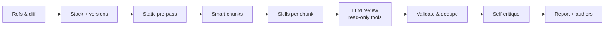

<p align="center">
  
</p>

<h1 align="center">Code Reviewer</h1>

<p align="center">
  <b>“Next-level LLM code review.”</b><br>
  Fewer false positives. The bugs a single LLM pass misses. Every changed line checked.
</p>

<p align="center">
  <a href="https://github.com/antonio112009/code-reviewer/actions/workflows/ci.yml"></a>
  <a href="https://www.npmjs.com/package/@antonio112009/code-reviewer"></a>
  
  
  <a href="LICENSE"></a>
</p>

---

LLM reviewers are fast, but they are noisy. They flag things that aren't bugs, miss the subtle defects on
the first pass, and skim big changes. **Code Reviewer** wraps the model you already use — Claude Code,
Codex, Copilot, Gemini or AWS Bedrock — in a review pipeline built against exactly that:
- **Skills.** Technology- and version-specific checklists tell the model where bugs hide in *this* code.
- **Static hints.** Fast analyzers point at exact lines; the model confirms or rejects each one.
- **Self-critique.** A second pass throws out what it cannot prove.
- **Full coverage.** Every chunk of the change is reviewed, with the related files next to it.

## Quick start

Requires **Node.js ≥ 24**, **git**, and one provider: the Claude Code, Codex, Copilot or Gemini CLI
logged in, an `ANTHROPIC_API_KEY`, AWS credentials for Bedrock, or an OpenAI-compatible API (OpenAI,
OpenRouter, a local Ollama, …).

```bash
npm install -g @antonio112009/code-reviewer

cd /path/to/your/project
code-reviewer init        # detects your stack and providers, writes .code-reviewer/config.yaml
code-reviewer review      # reviews your branch against its base branch
```

`code-reviewer upgrade` updates it later and shows what changed (`--check` only looks). An interactive
review says once a day when a new version is out; `CODE_REVIEWER_NO_UPDATE_CHECK=1` turns that off.

<details>
<summary>Other ways to install</summary>

From the latest GitHub release:

```bash
npm install -g https://github.com/antonio112009/code-reviewer/releases/latest/download/code-reviewer.tgz
```

From a clone:

```bash
git clone https://github.com/antonio112009/code-reviewer.git
cd code-reviewer
npm install && npm run build
npm link           # puts `code-reviewer` on your PATH
```

</details>

Everyday commands:

```bash
code-reviewer review                          # your branch vs its base (auto-detected), every real defect
code-reviewer review --essential              # only what can seriously hurt production: cheaper, far fewer findings
code-reviewer review --base main --fail-on major   # CI gate: exit code 1 on major or critical findings
code-reviewer review --staged                 # what you are about to commit (--uncommitted: all local changes)
code-reviewer hook install                    # review the staged changes before every commit
code-reviewer review --dry-run                # the plan only: chunks, skills, hints — no LLM calls
code-reviewer review --post                   # then comment on the branch's pull / merge request
code-reviewer files src/payments              # review whole files or folders
code-reviewer runs open latest                # the HTML report of the last run
code-reviewer eval --compare latest           # measure recall / precision on cases with known bugs
```

### Compare two branches

`--base` is the branch the work started from, `--head` the branch with the work. Like a pull request, the
review covers what `--head` changed since it left `--base` (`merge-base(base, head)..head`), not what changed
on `--base` in the meantime.

```bash
# feature/login against main: the same changes a pull request would show
code-reviewer review --base main --head feature/login

# only what can seriously hurt production (about a third cheaper, a fifth of the findings)
code-reviewer review --base main --head feature/login --essential

# a release branch against the previous one, reports (md + html) copied to ./reports
code-reviewer review --base origin/release/2.3 --head origin/release/2.4 --format md,html --out reports

# the plan first — files, chunks, skills, static hints — without calling a model
code-reviewer review --base main --head feature/login --dry-run
```

- A bare base name (`main`) means the freshly fetched remote branch; `origin/main` or a commit sha works too.
  `--offline` compares local refs without fetching.
- `--head` defaults to `HEAD`, unpushed commits included. `--explain-refs` prints how both were resolved.
- The default depth, `full`, reports every real defect. `--essential` keeps to what can seriously hurt
  production (security, data loss, crashes, leaks, overload, costly performance) for about a third less.
- With Claude Code, Sonnet reviews and Sonnet checks each finding (`--model` / `--critique-model` to change;
  an Opus critic measured the same quality for 40% more). `--max-cost 5` stops starting model calls once $5 is spent.

## Why Code Reviewer

- **Fewer false positives.** Every finding needs a concrete failure scenario and a confidence score. A
  self-critique pass re-checks each one against the code, static hints count only when the model
  confirms them, and anything below your confidence threshold is dropped.
- **Finds what one pass misses.** 850+ small skills (React effects, Next.js caching, Django ORM, Go
  concurrency, PostgreSQL locks, Kubernetes security, …) are picked per chunk from the detected stack
  and the **versions** in your manifests. Only relevant skills are loaded, never "all of JavaScript".
- **Covers the whole change.** Related files (imports, tests, siblings) are reviewed together and shared
  files are added as read-only context, so nothing is silently dropped.
- **Two depths.**
  - `full`, the default: every real defect, including edge cases and accessibility.
  - `essential`: only what can seriously hurt production — security, data loss, crashes, memory leaks / OOM,
    overload, costly performance — using fewer tokens.
- **Your models, per stage.** A fast model for the review and a stronger one for verification, each
  with its own reasoning effort. If a model becomes unavailable, it offers an alternative (Claude ↔
  Codex, …).
- **Safe on untrusted code.** Agents read an isolated, read-only snapshot, and nothing from the reviewed
  repository is ever executed. Ctrl+C stops every process cleanly.

## How it works



1. **Refs.** Picks the base branch (CI pull request, open PR/MR, branch rules such as `feature/** →
   develop → main`) and fetches it fresh.
2. **Stack and hints.** Detects technologies and versions from manifests. Runs secret scanning, about
   130 bug-pattern rules, safe external linters and the skills' ast-grep checks, whose hits become hints.
3. **Chunks.** Groups related files into chunks that fit the model's context window. Each chunk gets an
   impact map: where unchanged code uses what changed and where the functions it calls are defined
   (file:line). With `--expand refs|deep`, excerpts of that code too.
4. **Review.** For every chunk:
   - selects the matching skills;
   - runs the model with read-only tools: `read_file`, `grep`, `find_symbol`, `find_references`, `list_dir`, `git_log`, `git_blame`;
   - collects findings through a strict JSON contract.
5. **Verify.** Validates the findings (real file, real lines, near the change), dedupes them, and sends
   them to self-critique.
6. **Report.** A live terminal dashboard, then Markdown / JSON / HTML / SARIF / GitLab Code Quality reports
   with authors and GitHub/GitLab links. Every run is saved, and can be posted to its pull request.

## Providers

| Provider | Uses | Notes |
|---|---|---|
| `claude` | Claude Code over [ACP](https://agentclientprotocol.com) | your Claude Code login; reviews and critiques with Sonnet (1M context) by default; `--model opus` for a deeper review. Review sessions load none of your plugins, hooks or settings (only the `env` / `apiKeyHelper` sign-in); `providers.claude.userSettings: true` in the global config loads them |
| `codex` | OpenAI Codex over ACP | experimental; can run commands, so it is never picked as an automatic fallback |
| `copilot` | GitHub Copilot CLI over ACP | experimental |
| `gemini` | Gemini CLI over ACP | experimental |
| `anthropic` | the Anthropic API directly | `ANTHROPIC_API_KEY`; `claude-sonnet-5-5` by default. No agent in between: a task carries only our prompt (Claude Code adds ~25× more context per task), with prompt caching — the cheaper choice for CI |
| `bedrock` | AWS Bedrock (Converse API) | AWS credential chain (profile, SSO, role) or `AWS_BEARER_TOKEN_BEDROCK`; prompt caching for Anthropic models |
| `openai` | the OpenAI API | `OPENAI_API_KEY`; no default model: `--model gpt-5` |
| `openrouter` | [OpenRouter](https://openrouter.ai) | `OPENROUTER_API_KEY`; `--model` any OpenRouter id, e.g. `qwen/qwen3-coder` |
| `ollama` | a local [Ollama](https://ollama.com) server | no key; `--model qwen3-coder:30b`. The code never leaves the machine |

The model must support tool calling: findings come back through a tool. Any other OpenAI-compatible
server (vLLM, LM Studio, LiteLLM, Azure OpenAI's v1 API, …) is a provider of type `openai` in your global
config:

```yaml
providers:
  lmstudio:
    type: openai
    baseUrl: http://localhost:1234/v1
    apiKeyEnv: none            # the environment variable with the key; `none` for no authentication
    defaultModel: qwen3-coder-30b
    reasoningEffort: false     # true sends the role's reasoning level (reasoning models only)
roles:
  review: { provider: lmstudio }
```

Local models have small context windows: set `roles.review.contextWindow` (or `--max-chunk-tokens`) so
that chunks fit. Ollama silently cuts prompts longer than its context length, so raise that too
(`OLLAMA_CONTEXT_LENGTH`).

```bash
code-reviewer providers list                   # what is installed and logged in
code-reviewer providers test claude --model sonnet
```

## Review depth

Measured on 30 real pull requests (AACR-Bench ctx30, two runs each; "precision" is the share of findings
that match a comment human reviewers left, so real defects they did not write down count against it):

| | Findings | Matching a human comment | Human comments found | Cost |
|---|---|---|---|---|
| `--essential` | 9.5, all major | 63% | 2.1% (code defects 4.4%) | $5.1 |
| `full` (default) | 47.5 | 46% | 7.7% (code defects 12.2%) | $7.6 |
| `--deepen` | 70.5 | 38% | 9.4% (code defects 13.7%) | $13.1 |

`essential` reports about one finding per three pull requests: the ones that can seriously hurt production,
and every one of them is also in the `full` review. `full` costs half as much again and finds almost four
times as many of the human comments, which is why it is the default. Reading the code is what costs, not the
number of findings, so `essential` saves less than it leaves out.

| | `essential` (`--essential`) | `full` (default) |
|---|---|---|
| Looks for | security, data loss, crashes/hangs, leaks & OOM, overload (unbounded concurrency, missing timeouts, retry storms, N+1), races, costly performance | every real defect, also edge cases, accessibility, best practices with a concrete consequence |
| Severities | critical, major | all |
| Skills | essential ones, 3.5k tokens per chunk | all, 6k tokens per chunk |
| Fix required | yes, for every finding | when possible |
| Self-critique | also drops real but low-impact findings; keeps confidence ≥ 0.7 | drops only claims it can refute (low impact lowers the severity); keeps confidence ≥ 0.3 |
| Corrected titles | an overstated headline over a real defect is kept with a corrected title (the report shows the original) | same |
| Second opinion | off (`--second-opinion` turns it on) | findings the critic was not sure about are re-checked by a second verifier |
| "Worth a look" | — | findings below confidence 0.6 and `info` findings: in the reports, not in PR comments, SARIF / Code Quality or `--fail-on` |

### A second look for important changes (`--deepen`, experimental)

A reviewer tends to report one defect in a place and move on, while the same function often holds more: the
cached handle is found, the unchecked call next to it is not. With `--deepen`, every chunk that had findings is
reviewed once more. The model gets what was found so far and is asked only for *other* defects in the same
functions: calls whose failure is not handled, resources not released on every path, state left behind by an
early return, code that must change together.

| AACR-Bench ctx30 (30 real PRs, two runs each) | Recall | Code-defect recall | Precision | Cost per run |
|---|---|---|---|---|
| default | 7.7% | 12.2% | 46.3% | $7.6 |
| `--deepen` | 9.4% | 13.7% | 38.3% | $13.1 |

- **When:** changes where a missed defect is expensive: payments, authentication, migrations, a release
  branch. For everyday pull requests the default is the better trade.
- **Cost:** chunks with findings are reviewed twice; the repeat reuses the cached prompt, so it adds about
  70% rather than doubling the price.
- **Noise:** it reports half as many findings again (70 against 47 on these PRs), most of them minor, and a
  smaller share of them match what human reviewers wrote (38% against 46%). The references matched go from
  22 to 27: a fifth more real defects for a lot more to read.
- **Suggested, not automatic:** after a review with findings, the summary and the markdown report suggest
  `--deepen` with its estimated cost (also `advice.deepen` in the JSON). With the result cache on (the
  default), the re-run takes its first looks from the cache and pays only for the second looks.
- Off by default. `review.deepen: true` in `.code-reviewer/config.yaml` turns it on for a repository.

## Before you commit

`review` compares commits. To review changes that are not committed yet:

```bash
code-reviewer review --staged                 # the staged changes, exactly what `git commit` records
code-reviewer review --uncommitted            # every change of the working tree, untracked files too
code-reviewer review --uncommitted --base main   # the branch and its uncommitted changes
```

Both compare against HEAD unless `--base` is given. The changes are committed to a throw-away commit on
top of HEAD that no branch points to: your index, working tree and refs stay as they are, and the review
works as for any commit (isolated snapshot, cache, blame). Ignored files and the runs directory are never
taken in. Such a run has no links to the forge and cannot be posted to a pull request.

`code-reviewer hook install` adds a git pre-commit hook that runs `review --staged --fail-on major`:
findings of that severity block the commit, and anything else lets it through (no provider available,
nothing staged, errors). Skip it once with `git commit --no-verify` or `CODE_REVIEWER_SKIP=1`.

```bash
code-reviewer hook install --fail-on critical -- --provider ollama --model qwen3-coder:30b
code-reviewer hook uninstall
```

It never overwrites a hook it did not write. When another tool manages the hooks (`core.hooksPath`:
husky, lefthook, …), it prints the command to add to that tool's pre-commit hook instead. A local model
keeps the code on your machine and costs nothing per commit.

## Configuration

`code-reviewer init` asks a few questions and writes a commented `.code-reviewer/config.yaml`. Settings
are applied in this order, later ones winning:
1. defaults;
2. `~/.code-reviewer/config.yaml`;
3. the project config;
4. `--profile`;
5. flags.

```yaml
project:
  name: billing-service
  focus: [security, data-integrity, concurrency]
roles:
  review:   { provider: claude, model: sonnet, reasoning: medium } # the defaults
  critique: { provider: claude, model: sonnet, reasoning: high }   # the defaults too
review:
  depth: full               # the default; essential = only serious production issues
  minConfidence: 0.3        # the default at full depth (0.7 at essential)
  exclude: ["**/*.generated.ts"]
git:
  base: { rules: [{ match: "feature/**", base: [develop, main] }] }
```

Useful flags:
- `--provider`, `--model`, `--reasoning`: the review model;
- `--critique-*` and `--no-self-critique`: the verification pass;
- `--skills a,b`: pick skills by hand;
- `--analyzers eslint,tsc`: opt-in project linters;
- `--passes local,contracts`: review each chunk twice — once for defects in the changed lines, once for the
  changed declarations and their consumers (about twice the cost);
- `--audit` (experimental): the prompt lists every changed function and the model audits each one, instead
  of stopping at the first defect of a function;
- `--deepen` (experimental): a second look at every chunk with findings, for other defects in the same
  functions ([when to use it](#a-second-look-for-important-changes---deepen-experimental));
- `--second-opinion` / `--no-second-opinion`: findings the critic was not sure about (confidence around the
  bar of the main report) go to a second verifier that reads further — callers, implementations, what
  produces the value — and decides. On by default at full depth (precision 40% → 46% on AACR-Bench for 10%
  more cost), off at essential depth;
- `--expand off|map|refs|deep`: related unchanged code per chunk — `map` (the default) lists where unchanged
  code uses the changed declarations and where the functions the new code calls are defined; `refs` adds
  excerpts of that code; `deep` also who calls those usages;
- `--authors`: author attribution;
- `--json`, `--plain`: output format;
- `--format md,json,html,sarif,codequality`, `--out <dir>`: report files;
- `--post` (with `--pr`, `--repo`, `--forge`, `--api-url`, `--force`): comment on the pull / merge request;
- `--offline`: no fetch.

`code-reviewer config show` prints the effective configuration.

A project config comes from the checkout under review, so it may not choose programs, the server your code
and API key are sent to (`baseUrl`, `apiKeyEnv`), model fallbacks or analyzers that execute code. Those
live in the global config only.

### Cost

Every run records tokens, model requests and cost, failed attempts included. The cost comes from the
provider when it reports one (Claude Code does). Otherwise it is tokens × your `pricing`. Without a price
it is shown as unknown, with the routes that need one. Providers that report no token counts (e.g. Copilot)
get an estimate, marked as such. `--dry-run` shows a lower bound before anything is sent.

```yaml
pricing:                          # example values: use your own prices
  "bedrock:global.anthropic.claude-sonnet-4-5": { input: 3, cachedInput: 0.3, output: 15 }  # USD / 1M tokens
  copilot: { request: 0.04 }      # per premium request
  ollama: { input: 0, output: 0 } # local models
```

`--max-cost 2` (`review.maxCost`) caps a run at $2: no model call starts once that much is spent, and with
self-critique on, reviews stop at 85% so the rest can verify their findings. Calls already running finish.
Parts left unreviewed are marked `budget` in the summary, and `--fail-on` does not pass them. Calls without
a known cost cannot count and are named in a warning.

### Cache

Model answers are cached, so a second review of the same code costs nothing: after a fix, only the chunks
that changed are sent to the model again, and the critic's verdicts on unchanged findings are reused too.
An answer is reused only while the chunk's code, the instructions and skills, the static hints, the model
and **every file the model read** (through `read_file`, `grep` or the agent's own read tools) are the same.
Early answers from a model that ran out of time are never cached, and `eval` never uses the cache.

- Where: the platform's cache directory (`~/Library/Caches/code-reviewer`, `~/.cache/code-reviewer`,
  `%LOCALAPPDATA%\code-reviewer\Cache`), else the temp directory. Set `CODE_REVIEWER_CACHE_DIR`, or
  `cache.dir` in the global config (an absolute path, or `project` for `.code-reviewer/cache`). When no
  directory is writable (locked-down machines), the review runs without a cache.
- Entries are signed with a key kept in `~/.code-reviewer/cache.key` (or `CODE_REVIEWER_CACHE_KEY`), so a
  cache inside a repository or restored in CI cannot be seeded with fake "clean" answers.
- `--no-cache` reviews everything again. Entries unused for `cache.maxAgeDays` (30) or above
  `cache.maxSizeMb` (500) are removed daily; `code-reviewer cache info | prune | clear` does it by hand.

## When a model runs out of time or steps

A chunk is never silently skipped. The model submits findings as it verifies them, so a review cut short
keeps what was already submitted. If it runs out of time, tool steps or output, it also gets one short turn
to submit what it found but had not submitted yet. If nothing comes of it, the chunk
is split in two and the halves are reviewed separately; a single file that timed out gets one retry with
twice the time. A chunk that still fails is reported with the reason and what to change (for example
`step-limit: raise review.maxSteps or lower --max-chunk-tokens`), and `--fail-on` fails the gate.

## Skills

Skills are small Markdown checklists in a tree by language and technology: `javascript/react/effects`,
`python/django/orm-performance`, `databases/postgresql/core`, … Each folder's `_group.yaml` says how to
recognize the technology. A skill loads only when its technology is in the chunk and the changed code
touches its topic, optionally gated on versions (`framework.react: ">=19"`).

```bash
code-reviewer skills list javascript/react     # the tree, detection rules and sizes
code-reviewer skills detect                    # your stack, versions and the skills that apply
code-reviewer skills usage                     # over saved runs: chunks each skill was in, findings it led to,
                                               # how often the skill budget left it out
```

A finding names the checklist that led to it (`from checklist: go/core/json` in the report), so `skills usage`
shows which skills earn their place in the prompt and which never lead to anything.

Add your own skills in `~/.code-reviewer/skills/` or `<repo>/.code-reviewer/skills/`. See
[docs/skills.md](docs/skills.md) for the format.

## Measuring quality

`code-reviewer eval` reviews a corpus of small changes with known defects and scores the result, so
prompt, skill, model and depth changes can be compared by numbers:
- **recall**: the share of known bugs found; **precision**: how much of what was reported is right;
- **false positives** on clean changes (refactors, renames, test-only changes, correct fixes);
- the **self-critique effect**: recall it cost and noise it removed;
- tokens and time.

```bash
code-reviewer eval                                  # the built-in corpus: 17 cases, 8 stacks
code-reviewer eval --filter security --repeat 3     # a subset, three runs per case (LLM variance)
code-reviewer eval --model opus --compare latest    # deltas against the previous eval
code-reviewer eval my-cases/ --min-recall 0.7       # your own cases as a CI gate
```

Cases are YAML files with the base files, the change, and the exact lines of each expected defect; a
case can also point at two commits of a real repository. Results are saved in
`.code-reviewer/evals/<id>/`. See [docs/evals.md](docs/evals.md) for the format, how findings are
matched and how to read the numbers.

## Reports and history

Each run is saved in `.code-reviewer/runs/<id>/` (add it to `.gitignore`; `init` offers to). Use
`code-reviewer runs list | show | export | open | publish | rm` to browse runs. Reports include every finding
with its confidence, the critic's verdict, the author and links, plus what was rejected and why, and a
coverage map: which changed files were reviewed in full, cut short, not reviewed or skipped.

Report formats (`--format` or `output.formats`):

| Format | File | For |
|---|---|---|
| `md` | `report.md` | reading, wikis |
| `json` | `report.json` | the full run record, for scripts |
| `html` | `report.html` | an interactive, self-contained page |
| `sarif` | `report.sarif` | SARIF 2.1.0: GitHub code scanning and other SARIF viewers |
| `codequality` | `report.codequality.json` | GitLab Code Quality (merge request widget) |

Only reported findings are exported to SARIF and Code Quality, never rejected ones or those listed as "worth
a look" (lower confidence or `info`; they are in the Markdown, HTML and JSON reports). Every finding has a stable
fingerprint (its file, category and code, not line numbers), so code scanning and GitLab track it across runs.

For debugging, every run also keeps `run.log` (every message, debug included, and the main events: plan,
each chunk's outcome and recovery, fallbacks, warnings, totals) and, in `chunks/`, each chunk's prompt,
the model's reply and what it handed in — also for chunks that failed. `--verbose` prints the same debug
messages live; `-v` prints the version.

## Pull request comments and CI

`code-reviewer review --post` posts the finished review to the branch's GitHub pull request or GitLab merge
request: an inline comment on each finding inside the diff, and one summary comment (counts, the other
findings, unreviewed code) that later runs update in place. When the fix only changes the commented lines
and the self-critique checked it, the comment carries a one-click suggested change ("Commit suggestion" on
GitHub, "Apply suggestion" on GitLab). Re-runs do not repeat comments that are already
there, and resolve the threads of findings that were fixed: the commented code changed and the new review
did not report the finding again (`publish.resolveFixed`; a thread someone reopened stays open). After a new
push, the summary also lists what changed since the previous review: fixed, no longer reported, new, and how
many are still open.
`code-reviewer runs publish latest --dry-run` shows what would be posted.

```bash
export GITHUB_TOKEN=…            # or GH_TOKEN; GITLAB_TOKEN for GitLab (api scope)
code-reviewer review --post
code-reviewer runs publish latest --pr 42 --repo acme/shop
```

For CI there is a GitHub Action ([`action.yml`](action.yml)) and a GitLab CI template
([`ci/gitlab/code-reviewer.gitlab-ci.yml`](ci/gitlab/code-reviewer.gitlab-ci.yml)). Setup, permissions,
providers in CI and the token rules: [docs/ci.md](docs/ci.md).

## Development

```bash
npm install && npm run build && npm run typecheck && npm run lint && npm test
```

- **CI.** GitHub Actions run on every push and pull request:
  - typecheck, lint, build and a package check;
  - the tests on Linux and macOS with Node 24 (LTS) and 26;
  - a Windows smoke test;
  - dependency review, and CodeQL security scanning.

  Actions are pinned to commit SHAs, and Dependabot keeps them and the npm dependencies current.
- **Release.** Bump `version` in `package.json`, add the notes to `CHANGELOG.md`, then push a matching
  tag (`git tag v0.1.1 && git push origin v0.1.1`). The release workflow:
  - tests and packs the package, and attests its build provenance;
  - publishes a GitHub release with `code-reviewer.tgz`;
  - stages `@antonio112009/code-reviewer` on npm through Trusted Publishing. It goes live once you
    approve it with 2FA: `npm stage list`, then `npm stage approve <id>`, or on npmjs.com.

  Verify a download with `gh attestation verify code-reviewer.tgz --repo antonio112009/code-reviewer`.
  Coding agents (Claude Code, Codex, GitHub Copilot) can run the whole procedure with the `release`
  skill in `.agents/skills/` and `.claude/skills/`.

Architecture, contracts and the safety model: [docs/ARCHITECTURE.md](docs/ARCHITECTURE.md). Changes:
[CHANGELOG.md](CHANGELOG.md).

## Roadmap

- Structural checks (ast-grep) available to the model as a tool, and more checks in the skills.
- Bitbucket and Azure DevOps comments.

## License

[MIT](LICENSE) © 2026 antonio112009
