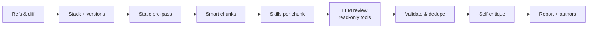

<p align="center">
  
</p>

<h1 align="center">Code Reviewer</h1>

<p align="center">
  <b>“Next-level LLM code review.”</b><br>
  Fewer false positives. The bugs a single LLM pass misses. Every changed line checked.
</p>

<p align="center">
  <a href="https://github.com/antonio112009/code-reviewer/actions/workflows/ci.yml"></a>
  <a href="https://www.npmjs.com/package/@antonio112009/code-reviewer"></a>
  = 24" src="https://img.shields.io/badge/node-%E2%89%A5%2024-22d3ee">
  
  <a href="LICENSE"></a>
</p>

---

LLM reviewers are fast, but they are noisy. They flag things that aren't bugs, miss the subtle defects on
the first pass, and skim big changes. **Code Reviewer** wraps the model you already use — Claude Code,
Codex, Copilot, Gemini or AWS Bedrock — in a review pipeline built against exactly that:
- **Skills.** Technology- and version-specific checklists tell the model where bugs hide in *this* code.
- **Static hints.** Fast analyzers point at exact lines; the model confirms or rejects each one.
- **Self-critique.** A second pass throws out what it cannot prove.
- **Full coverage.** Every chunk of the change is reviewed, with the related files next to it.

## Quick start

Requires **Node.js ≥ 24**, **git**, and one provider: the Claude Code, Codex, Copilot or Gemini CLI
logged in, an `ANTHROPIC_API_KEY`, or AWS credentials for Bedrock.

```bash
npm install -g @antonio112009/code-reviewer

cd /path/to/your/project
code-reviewer init        # detects your stack and providers, writes .code-reviewer/config.yaml
code-reviewer review      # reviews your branch against its base branch
```

<details>
<summary>Other ways to install</summary>

From the latest GitHub release:

```bash
npm install -g https://github.com/antonio112009/code-reviewer/releases/latest/download/code-reviewer.tgz
```

From a clone:

```bash
git clone https://github.com/antonio112009/code-reviewer.git
cd code-reviewer
npm install && npm run build
npm link           # puts `code-reviewer` on your PATH
```

</details>

Everyday commands:

```bash
code-reviewer review                          # your branch vs its base (auto-detected), essential depth
code-reviewer review --full                   # every real defect, not only production-critical ones
code-reviewer review --base main --fail-on major   # CI gate: exit code 1 on major or critical findings
code-reviewer review --dry-run                # the plan only: chunks, skills, hints — no LLM calls
code-reviewer review --post                   # then comment on the branch's pull / merge request
code-reviewer files src/payments              # review whole files or folders
code-reviewer runs open latest                # the HTML report of the last run
code-reviewer eval --compare latest           # measure recall / precision on cases with known bugs
```

## Why Code Reviewer

- **Fewer false positives.** Every finding needs a concrete failure scenario and a confidence score. A
  self-critique pass re-checks each one against the code, static hints count only when the model
  confirms them, and anything below your confidence threshold is dropped.
- **Finds what one pass misses.** 850+ small skills (React effects, Next.js caching, Django ORM, Go
  concurrency, PostgreSQL locks, Kubernetes security, …) are picked per chunk from the detected stack
  and the **versions** in your manifests. Only relevant skills are loaded, never "all of JavaScript".
- **Covers the whole change.** Related files (imports, tests, siblings) are reviewed together and shared
  files are added as read-only context, so nothing is silently dropped.
- **Two depths.**
  - `essential`, the default: only what can seriously hurt production — security, data loss, crashes,
    memory leaks / OOM, overload, costly performance — using fewer tokens.
  - `full`: every real defect, including edge cases and accessibility.
- **Your models, per stage.** A fast model for the review and a stronger one for verification, each
  with its own reasoning effort. If a model becomes unavailable, it offers an alternative (Claude ↔
  Codex, …).
- **Safe on untrusted code.** Agents read an isolated, read-only snapshot, and nothing from the reviewed
  repository is ever executed. Ctrl+C stops every process cleanly.

## How it works



1. **Refs.** Picks the base branch (CI pull request, open PR/MR, branch rules such as `feature/** →
   develop → main`) and fetches it fresh.
2. **Stack and hints.** Detects technologies and versions from manifests. Runs secret scanning, about
   130 bug-pattern rules and safe external linters, whose hits become hints.
3. **Chunks.** Groups related files into chunks that fit the model's context window.
4. **Review.** For every chunk:
   - selects the matching skills;
   - runs the model with read-only tools: `read_file`, `grep`, `find_symbol`, `git_blame`, `get_skill`;
   - collects findings through a strict JSON contract.
5. **Verify.** Validates the findings (real file, real lines, near the change), dedupes them, and sends
   them to self-critique.
6. **Report.** A live terminal dashboard, then Markdown / JSON / HTML / SARIF / GitLab Code Quality reports
   with authors and GitHub/GitLab links. Every run is saved, and can be posted to its pull request.

## Providers

| Provider | Uses | Notes |
|---|---|---|
| `claude` | Claude Code over [ACP](https://agentclientprotocol.com) | your Claude Code login; reviews with Sonnet (1M context) and critiques with Opus by default; `--model opus` for a deeper review |
| `codex` | OpenAI Codex over ACP | experimental; can run commands, so it is never picked as an automatic fallback |
| `copilot` | GitHub Copilot CLI over ACP | experimental |
| `gemini` | Gemini CLI over ACP | experimental |
| `anthropic` | the Anthropic API directly | `ANTHROPIC_API_KEY`; `claude-sonnet-5` by default. No agent in between: a task carries only our prompt (Claude Code adds ~25× more context per task), with prompt caching — the cheaper choice for CI |
| `bedrock` | AWS Bedrock (Converse API) | AWS credential chain (profile, SSO, role) or `AWS_BEARER_TOKEN_BEDROCK`; prompt caching for Anthropic models |

```bash
code-reviewer providers list                   # what is installed and logged in
code-reviewer providers test claude --model sonnet
```

## Review depth

| | `essential` (default) | `full` (`--full`) |
|---|---|---|
| Looks for | security, data loss, crashes/hangs, leaks & OOM, overload (unbounded concurrency, missing timeouts, retry storms, N+1), races, costly performance | every real defect, also edge cases, accessibility, best practices with a concrete consequence |
| Severities | critical, major | all |
| Skills | essential ones, 3.5k tokens per chunk | all, 6k tokens per chunk |
| Fix required | yes, for every finding | when possible |

## Configuration

`code-reviewer init` asks a few questions and writes a commented `.code-reviewer/config.yaml`. Settings
are applied in this order, later ones winning:
1. defaults;
2. `~/.code-reviewer/config.yaml`;
3. the project config;
4. `--profile`;
5. flags.

```yaml
project:
  name: billing-service
  focus: [security, data-integrity, concurrency]
roles:
  review:   { provider: claude, model: sonnet, reasoning: high }   # the defaults
  critique: { provider: claude, model: opus, reasoning: high }     # the defaults too
review:
  depth: essential          # or full
  minConfidence: 0.7
  exclude: ["**/*.generated.ts"]
git:
  base: { rules: [{ match: "feature/**", base: [develop, main] }] }
```

Useful flags:
- `--provider`, `--model`, `--reasoning`: the review model;
- `--critique-*` and `--no-self-critique`: the verification pass;
- `--skills a,b`: pick skills by hand;
- `--analyzers eslint,tsc`: opt-in project linters;
- `--authors`: author attribution;
- `--json`, `--plain`: output format;
- `--format md,json,html,sarif,codequality`, `--out <dir>`: report files;
- `--post` (with `--pr`, `--repo`, `--forge`, `--api-url`, `--force`): comment on the pull / merge request;
- `--offline`: no fetch.

`code-reviewer config show` prints the effective configuration.

A project config comes from the checkout under review, so it may not choose programs, model fallbacks or
analyzers that execute code. Those live in the global config only.

### Cost

Every run records tokens, model requests and cost, failed attempts included. The cost comes from the
provider when it reports one (Claude Code does). Otherwise it is tokens × your `pricing`. Without a price
it is shown as unknown, with the routes that need one. Providers that report no token counts (e.g. Copilot)
get an estimate, marked as such. `--dry-run` shows a lower bound before anything is sent.

```yaml
pricing:                          # example values: use your own prices
  "bedrock:global.anthropic.claude-sonnet-4-5": { input: 3, cachedInput: 0.3, output: 15 }  # USD / 1M tokens
  copilot: { request: 0.04 }      # per premium request
```

### Cache

Model answers are cached, so a second review of the same code costs nothing: after a fix, only the chunks
that changed are sent to the model again, and the critic's verdicts on unchanged findings are reused too.
An answer is reused only while the chunk's code, the instructions and skills, the static hints, the model
and **every file the model read** (through `read_file`, `grep` or the agent's own read tools) are the same.
Early answers from a model that ran out of time are never cached, and `eval` never uses the cache.

- Where: the platform's cache directory (`~/Library/Caches/code-reviewer`, `~/.cache/code-reviewer`,
  `%LOCALAPPDATA%\code-reviewer\Cache`), else the temp directory. Set `CODE_REVIEWER_CACHE_DIR`, or
  `cache.dir` in the global config (an absolute path, or `project` for `.code-reviewer/cache`). When no
  directory is writable (locked-down machines), the review runs without a cache.
- Entries are signed with a key kept in `~/.code-reviewer/cache.key` (or `CODE_REVIEWER_CACHE_KEY`), so a
  cache inside a repository or restored in CI cannot be seeded with fake "clean" answers.
- `--no-cache` reviews everything again. Entries unused for `cache.maxAgeDays` (30) or above
  `cache.maxSizeMb` (500) are removed daily; `code-reviewer cache info | prune | clear` does it by hand.

## When a model runs out of time or steps

A chunk is never silently skipped. If the model runs out of time, tool steps or output before it
submits, it first gets one short turn to submit what it has already found. If that fails too, the chunk
is split in two and the halves are reviewed separately; a single file that timed out gets one retry with
twice the time. A chunk that still fails is reported with the reason and what to change (for example
`step-limit: raise review.maxSteps or lower --max-chunk-tokens`), and `--fail-on` fails the gate.

## Skills

Skills are small Markdown checklists in a tree by language and technology: `javascript/react/effects`,
`python/django/orm-performance`, `databases/postgresql/core`, … Each folder's `_group.yaml` says how to
recognize the technology. A skill loads only when its technology is in the chunk and the changed code
touches its topic, optionally gated on versions (`framework.react: ">=19"`).

```bash
code-reviewer skills list javascript/react     # the tree, detection rules and sizes
code-reviewer skills detect                    # your stack, versions and the skills that apply
```

Add your own skills in `~/.code-reviewer/skills/` or `<repo>/.code-reviewer/skills/`. See
[docs/skills.md](docs/skills.md) for the format.

## Measuring quality

`code-reviewer eval` reviews a corpus of small changes with known defects and scores the result, so
prompt, skill, model and depth changes can be compared by numbers:
- **recall**: the share of known bugs found; **precision**: how much of what was reported is right;
- **false positives** on clean changes (refactors, renames, test-only changes, correct fixes);
- the **self-critique effect**: recall it cost and noise it removed;
- tokens and time.

```bash
code-reviewer eval                                  # the built-in corpus: 17 cases, 8 stacks
code-reviewer eval --filter security --repeat 3     # a subset, three runs per case (LLM variance)
code-reviewer eval --model opus --compare latest    # deltas against the previous eval
code-reviewer eval my-cases/ --min-recall 0.7       # your own cases as a CI gate
```

Cases are YAML files with the base files, the change, and the exact lines of each expected defect; a
case can also point at two commits of a real repository. Results are saved in
`.code-reviewer/evals/<id>/`. See [docs/evals.md](docs/evals.md) for the format, how findings are
matched and how to read the numbers.

## Reports and history

Each run is saved in `.code-reviewer/runs/<id>/` (add it to `.gitignore`; `init` offers to). Use
`code-reviewer runs list | show | export | open | publish | rm` to browse runs. Reports include every finding
with its confidence, the critic's verdict, the author and links, plus what was rejected and why.

Report formats (`--format` or `output.formats`):

| Format | File | For |
|---|---|---|
| `md` | `report.md` | reading, wikis |
| `json` | `report.json` | the full run record, for scripts |
| `html` | `report.html` | an interactive, self-contained page |
| `sarif` | `report.sarif` | SARIF 2.1.0: GitHub code scanning and other SARIF viewers |
| `codequality` | `report.codequality.json` | GitLab Code Quality (merge request widget) |

Only reported findings are exported to SARIF and Code Quality, never rejected ones. Every finding has a stable
fingerprint (its file, category and code, not line numbers), so code scanning and GitLab track it across runs.

For debugging, every run also keeps `run.log` (every message, debug included, and the main events: plan,
each chunk's outcome and recovery, fallbacks, warnings, totals) and, in `chunks/`, each chunk's prompt,
the model's reply and what it handed in — also for chunks that failed. `--verbose` prints the same debug
messages live; `-v` prints the version.

## Pull request comments and CI

`code-reviewer review --post` posts the finished review to the branch's GitHub pull request or GitLab merge
request: an inline comment on each finding inside the diff, and one summary comment (counts, the other
findings, unreviewed code) that later runs update in place. Re-runs do not repeat comments that are already
there. `code-reviewer runs publish latest --dry-run` shows what would be posted.

```bash
export GITHUB_TOKEN=…            # or GH_TOKEN; GITLAB_TOKEN for GitLab (api scope)
code-reviewer review --post
code-reviewer runs publish latest --pr 42 --repo acme/shop
```

For CI there is a GitHub Action ([`action.yml`](action.yml)) and a GitLab CI template
([`ci/gitlab/code-reviewer.gitlab-ci.yml`](ci/gitlab/code-reviewer.gitlab-ci.yml)). Setup, permissions,
providers in CI and the token rules: [docs/ci.md](docs/ci.md).

## Development

```bash
npm install && npm run build && npm run typecheck && npm run lint && npm test
```

- **CI.** GitHub Actions run on every push and pull request:
  - typecheck, lint, build and a package check;
  - the tests on Linux and macOS with Node 24 (LTS) and 26;
  - a Windows smoke test;
  - dependency review, and CodeQL security scanning.

  Actions are pinned to commit SHAs, and Dependabot keeps them and the npm dependencies current.
- **Release.** Bump `version` in `package.json`, add the notes to `CHANGELOG.md`, then push a matching
  tag (`git tag v0.1.1 && git push origin v0.1.1`). The release workflow:
  - tests and packs the package, and attests its build provenance;
  - publishes a GitHub release with `code-reviewer.tgz`;
  - stages `@antonio112009/code-reviewer` on npm through Trusted Publishing. It goes live once you
    approve it with 2FA: `npm stage list`, then `npm stage approve <id>`, or on npmjs.com.

  Verify a download with `gh attestation verify code-reviewer.tgz --repo antonio112009/code-reviewer`.
  Coding agents (Claude Code, Codex, GitHub Copilot) can run the whole procedure with the `release`
  skill in `.agents/skills/` and `.claude/skills/`.

Architecture, contracts and the safety model: [docs/ARCHITECTURE.md](docs/ARCHITECTURE.md). Changes:
[CHANGELOG.md](CHANGELOG.md).

## Roadmap

- Skill-bundled **structural checks** (ast-grep rules next to each skill). They will run before the LLM
  and be available to it as a tool.
- Reviewing staged/uncommitted changes.
- Resolving review threads whose finding was fixed; Bitbucket and Azure DevOps comments.

## License

[MIT](LICENSE) © 2026 antonio112009
