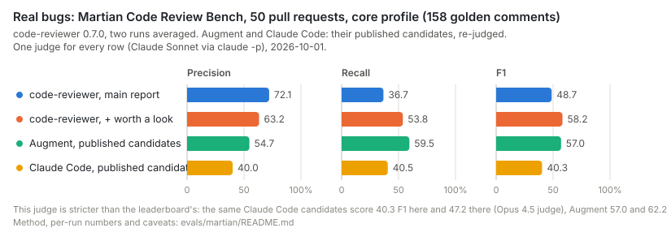

# Benchmarks

What Code Reviewer finds, measured on three kinds of ground truth, with the current numbers, how they moved
from release to release, and how to reproduce them. The detailed measurement logs are
[evals/martian/README.md](../evals/martian/README.md) (real bugs) and [evals/aacr/README.md](../evals/aacr/README.md)
(reviewers' comments); the built-in corpus is described in [evals.md](evals.md).

## Three kinds of ground truth

| Source | What a "hit" is | Size | What it tells |
|---|---|---|---|
| **Martian Code Review Bench** (offline) | a verified bug or remark in a real pull request, matched by text | 50 PRs of Sentry, Grafana, Cal.com, Discourse, Keycloak; 173 golden comments, 139 of them defects | how many known bugs a review finds, and how much else it reports |
| **AACR-Bench** (ctx30 and a held-out half) | a comment a human or an LLM reviewer left on the PR, matched on the same lines by text | 30 + 82 PRs of 22 repositories, 286 + 670 references; 79% written by LLM annotators, 40% about maintainability | how much the review resembles what reviewers write |
| **Built-in eval corpus** | a defect planted in a small change, matched by line | 33 cases, 8 stacks, 8 clean changes | regressions in prompts, skills and models; saturated at 100% recall |
| **Blind audit** | an auditor reading the code labels each finding real / debatable / wrong, without seeing its scores | 100–160 findings per release | the real precision of each tier and whether the scores are calibrated |

One judge (Claude Sonnet through `claude -p`) answers every benchmark's matching question, so rows within
a table are comparable with each other. They are not comparable with the vendors' leaderboards, whose judges
differ: the same Claude Code candidates score 40.3 F1 under our judge and 47.2 on Martian's board.

## Real bugs (Martian)

<picture>
  <source media="(prefers-color-scheme: dark)" srcset="img/martian-bench-dark.svg">
  
</picture>

Core profile (158 golden comments: bugs, security, concurrency, data, API, performance, test gaps,
documentation defects), 2026-10-01, code-reviewer 0.7.0 run twice:

| | Candidates / PR | Precision | Recall | F1 | Cost / PR |
|---|---|---|---|---|---|
| code-reviewer, main report | 1.6 | 72.1% | 36.7% | 48.7% | $0.40 |
| code-reviewer, main report + "worth a look" | 2.6 | 63.2% | 53.8% | 58.2% | $0.40 |
| Augment, published candidates | 3.4 | 54.7% | 59.5% | 57.0% | — |
| Claude Code, published candidates | 3.5 | 40.0% | 40.5% | 40.3% | — |

- Strict profile (139 defects), main report + "worth a look": precision 61.4%, recall 56.5%, F1 58.8%.
  By severity: Critical 8 of 12, High 35 of 54, Medium 35.5 of 61, Low 7.5 of 46 (both runs averaged).
- The two runs differ by up to 4 F1 points (one golden comment is 0.7 recall points).
- "Worth a look" — findings below confidence 0.6 and `info` findings, listed in the report but not posted to
  pull requests — raises recall by half for ten points of precision: on this benchmark half of them point at
  a known bug.

## Reviewers' comments (AACR-Bench)

<picture>
  <source media="(prefers-color-scheme: dark)" srcset="img/aacr-progress-dark.svg">
  
</picture>

| Configuration | ctx30: findings / P / R / F1 | held-out 82 PRs: findings / P / R / F1 | Cost / run (30 PRs) |
|---|---|---|---|
| 0.6.0, `--full` | 54.5 / 36.7% / 7.0% / 11.7% | — | $6.8 |
| 0.7.0 | 54.5 / 40.4% / 7.7% / 12.9% | 145 / 29.7% / 6.4% / 10.6% | $7.5 |
| + maintainability notes (`review.notes`) | 73.5 / 37.4% / 9.6% / 15.3% | 191 / 31.4% / 9.0% / 13.9% | $8.7 |
| + `--deepen` (independent second pass) | 150.5 / 28.6% / 15.0% / 19.7% | — | $17.7 |

Paired differences, clustered on repositories (`evals/aacr/stats.py`): the notes add 3.4 F1 points on the
held-out PRs (95% interval +1.2..+5.6) and 2.4 on ctx30; the second pass adds 4.4 more on ctx30 (+1.9..+7.2)
at twice the price. The critic changes of 0.7.0 together are +1.2 F1 with an interval of −1.7..+4.1: the
benchmark cannot resolve them, the blind audit can (below).

What bounds these numbers is the benchmark, not the search: of the 233 ctx30 references the reviewer had never
matched in 26 runs, 5 are concrete defects; the rest are maintainability remarks (93), unproven robustness
concerns (54, two thirds of them refuted by the code), comments that are wrong or about unchanged code (47),
and questions, design and micro-performance remarks (34). For comparison, OpenCodeReview reports 25.1% F1 on
the full benchmark with Claude Opus 4.6 and about 4.5 comments per PR, under a different judge.

## Blind audits

Independent auditors read the code behind each finding without seeing its severity, confidence, tier or
benchmark match (two auditors agree on "the claim holds" 97% of the time, κ 0.94; both are models, so their
errors may correlate).

| 0.7.0, 159 findings of two runs without the critic | Real | Debatable | Wrong or not a defect |
|---|---|---|---|
| all | 61% | 26% | 13% |
| reviewer severity `major` | 92% | — | — |
| reviewer confidence ≥ 0.75 / 0.60–0.75 / 0.45–0.60 / < 0.45 | 100% / 85% / 77% / 21% | | |
| main report after the critic (confidence ≥ 0.6) | 95–97% | | |
| "worth a look" after the critic | 33–35% | | |
| findings the critic removed | ≤ 1 of 6–9 per run | | |

Within one report, a real finding ranks above a not-real one in 88–91% of pairs (severity, then confidence).
Maintainability notes: 60% useful to a maintainer, 29% nits, 9% wrong before the critic's check; in half of
the cases a maintainer would ask for the change, and several were made upstream after the review.

## Reproducing

```bash
npm run build
evals/martian/setup.sh && evals/martian/run.sh m-1 --concurrency 3        # real bugs: review, judge, score
evals/martian/judge.py --baseline claude-code                             # a published tool under the same judge
evals/aacr/setup.sh && evals/aacr/run.sh a-1 --subset ctx30 --concurrency 3
evals/aacr/run.sh h-1 --subset hold82 --concurrency 3
evals/aacr/stats.py ctx30 a-1,a-2 b-1,b-2                                 # paired comparison with intervals
evals/aacr/audit.py sample ctx30 a-1 audit/a-1 --parts 3                  # blind-audit inputs
code-reviewer eval --full                                                 # the built-in corpus
```

A full round — two ctx30 runs, one held-out run, one Martian run — costs about $70 and resolves changes of
about 3 F1 points on AACR and 5 on Martian; single runs cannot. Judge noise is small (0.3–0.5 F1 points);
the reviewer's own run-to-run variation is what the repeats average out.

## Caveats

- Both benchmarks' repositories are public and famous; the golden comments and other tools' reviews of the same
  pull requests are public too. Training-data contamination cannot be excluded for any tool in the tables.
- Martian's golden set is incomplete and unversioned (every result records its hash); real findings outside
  it count as false positives, so precision is understated for everyone. Severity is not scored.
- AACR's references are mostly LLM-written and 40% maintainability; its score rewards volume and scope more
  than finding bugs. The held-out half scores every configuration lower than ctx30.
- Vendors' leaderboard rows were produced by hosted products reviewing GitHub pull requests with their
  titles and descriptions; our CLI sees the diff and the checkout, offline.

## History

- **2026-10-01** — Martian adapter and first results (0.7.0, two runs); maintainability notes and the
  `--deepen` second pass measured on ctx30 and the held-out half; blind audits of 278 findings.
- **2026-09-30** — 0.7.0: critic with three outcomes, second opinion, callee definitions; ctx30 F1 12.9%.
- **2026-09-29/30** — 0.6.0: Sonnet critic, `--deepen` second look, one defect per finding; ctx30 F1 11.7%.
- **2026-09-28** — AACR pilot (9 PRs): precision 30%, recall 5.5%.
